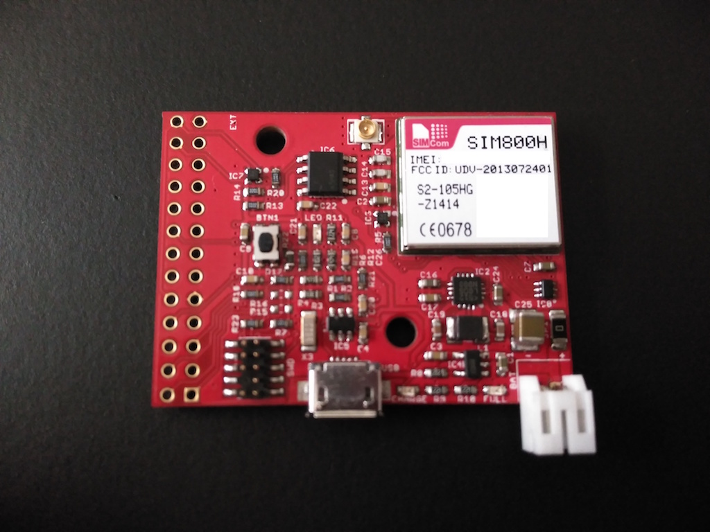
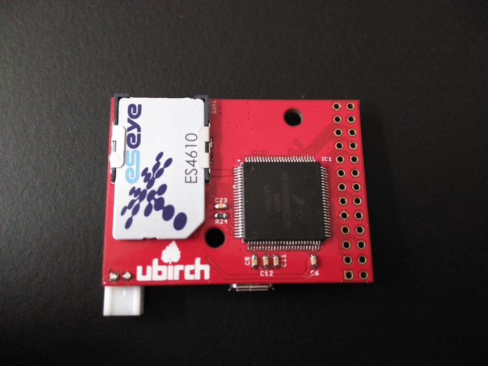

# ubirch#1 r0.2 board specific implementation

This is the ubirch#1 board revision 0.2. It has built in a single-color LED, an extra [Atmel ECC](http://www.atmel.com/products/security-ics/cryptoauthentication/ecc-256.aspx)
chip as well as a cell phone chip ([SIM800H/SIM800C](http://simcomm2m.com/En/module/detail.aspx?id=74)

* currently programmable by JTAG (SWD)
* serial debug console is configured on PTB16 (RX) )and PTB17 (TX)

